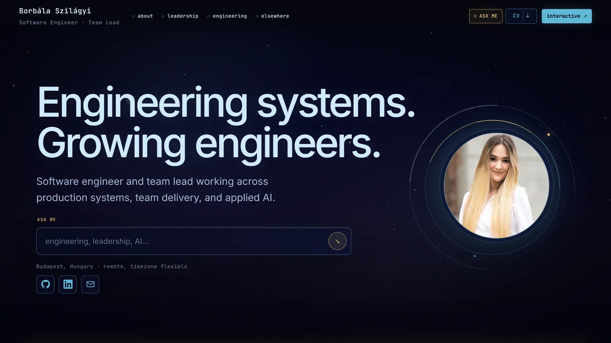
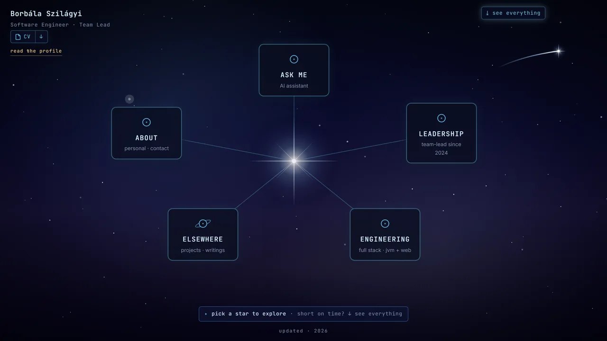

# PortfolioPage

A portfolio that ships the same content twice: once as a page you read, once as
a canvas you explore. Both render from one typed content source, so the copy
cannot drift between them.

## Two surfaces

**`/` — the written profile.** A linear, server-rendered page: hero, scoped AI
assistant, then the full profile in sections. Readable without JavaScript, and
the one that gets indexed.



**`/interactive` — the canvas.** The same content as a pentagon of destinations
around a central star. Each one unlocks through a small constellation puzzle, or
"see everything" skips straight to the content. Falls back to a vertical strip on
mobile and to a plain stack under `prefers-reduced-motion`.



Each links to the other, and `/interactive` canonicals to `/` — same content in
two presentations should be one indexed URL, not two competing ones.

## Goal

The goal is to make a portfolio feel more like a small product than a static
resume page:

- fast static first load
- rich interactive canvas on desktop
- simpler responsive flow on mobile
- project and writing cards that are easy to scan
- server-side AI assistant with strict scope, rate limits, and cost guards
- public-safe CV and contact surface

## Tech Stack

- **Astro 6** for the static site shell
- **React 19** islands for the interactive canvas, puzzles, cards, and chat
- **TypeScript 6**
- **Zustand 5** for per-tab canvas state
- **motion 12** for UI animation
- **Cloudflare Pages** for hosting
- **Cloudflare Pages Functions** for `/api/chat` and `/api/fortune`
- **Cloudflare KV** for chat rate-limit and token-budget counters
- **OpenAI-compatible or Anthropic** for the portfolio assistant — provider, model, and base URL set via env, so OpenRouter, Together, Groq, or a local Ollama work too
- **Vitest 4**, Testing Library, and MSW for tests

## Architecture

```text
functions/api/     Cloudflare Pages Functions
public/            Static assets and downloadable CV
src/components/    Canvas, puzzle, chat, and card UI
src/config/        Feature switches
src/content/       Typed portfolio content and assistant prompt
src/domain/        Pure domain logic
src/layouts/       Astro layouts
src/pages/         index (written profile), interactive (canvas), 404
src/services/      API/browser service wrappers
src/state/         Zustand state
src/styles/        Global CSS and design tokens
tests/             Unit and component tests
```

The site is static by default. Runtime behavior that needs secrets or abuse
guards is isolated in Cloudflare Pages Functions.

Both routes read `src/content/doors.data.ts`, which is typed as a union of
content blocks — paragraphs, metrics, quotes, project cards. Each surface decides
how to render a block; neither owns the words. A copy change lands in both.

## Checks

```bash
npm run test
npm run typecheck
npm run build
```

## License

Personal portfolio. Content, images, CV, and personal materials are not licensed
for reuse. Code is shared as-is for reference; no implicit license.
